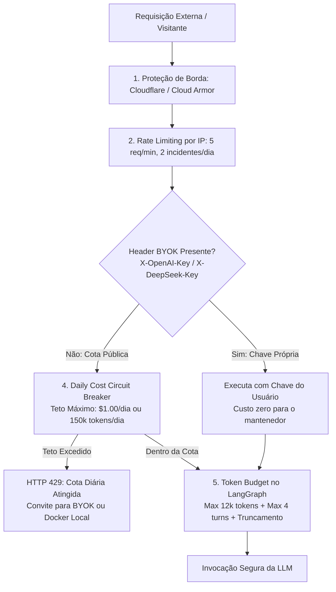

# FinOps e Arquitetura Scale-to-Zero ($0/mês) & Blindagem Anti-Abuso

O OpsMesh foi projetado desde o primeiro dia com uma filosofia **FinOps First**: garantir **$0/mês de infraestrutura ociosa** e **imunidade contra Denial of Wallet (DoW)** e estouro de tokens quando publicado online em código aberto.

---

## 1. Princípios do Custo Zero Ocioso (Scale-to-Zero)

1. **Computação Serverless Orientada a Eventos:**
   - O plano de controle é empacotado em contêineres Docker stateless executados no **Google Cloud Run** ou **Azure Container Apps**.
   - A configuração `min_instances = 0` (Scale-to-Zero) garante que, quando não houver incidentes, zero instâncias estarão ativas.
   - Fatura de computação ociosa: **$0.00 / mês**.

2. **Banco de Dados Serverless com Auto-Suspension:**
   - Checkpoints do LangGraph e logs de auditoria são armazenados em instâncias de **PostgreSQL Serverless** (ex.: Neon Database ou Supabase Free Tier).
   - O banco suspende a computação automaticamente após 5 minutos sem queries, mantendo custo nulo em períodos de calmaria.

3. **Banco Vetorial Embutido / Serverless:**
   - Para os runbooks de SRE, o OpsMesh utiliza o **Qdrant** em modo local/persistido em arquivo ou no tier gratuito perpétuo do Qdrant Cloud (1GB).

---

## 2. Blindagem em 5 Camadas Anti-Estouro de Tokens (Anti-DoW)

Para disponibilizar uma demonstração pública na web sem risco de robôs ou usuários mal-intencionados esgotarem o saldo de API do mantenedor:

### Detalhamento das Camadas:

1. **Proteção de Borda & Anti-DDoS:** Regras de firewall e bloqueio de scraping com Cloudflare Free Tier ou Google Cloud Armor.
2. **Rate Limiting por IP (Sliding Window):** Middleware `slowapi` limitando cada IP a no máximo 5 requisições por minuto e 2 incidentes completos por dia na cota pública gratuita.
3. **Padrão "Bring Your Own Key" (BYOK):** Visitantes podem fornecer sua própria chave via header HTTP (`X-OpenAI-API-Key` ou `X-DeepSeek-API-Key`), sem armazená-la no servidor, rodando ilimitadamente a custo zero para o projeto.
4. **Disjuntor Diário de Gastos (Daily Cost Circuit Breaker):** Uma tabela no PostgreSQL Serverless contabiliza os tokens consumidos no dia UTC. Se ultrapassar o teto (ex.: **$1.00/dia**), o disjuntor desarma e retorna `HTTP 429 Too Many Requests`.
5. **Modo Sandbox "Replay Zero-Token":** Visitantes comuns podem explorar os 4 cenários do Chaos Studio utilizando gravações de traces do LogHub cacheadas em disco, com **zero chamadas a APIs externas pagas**.
6. **Agent Token Budget & Turn Cap:** O grafo LangGraph limita cada incidente a 12.000 tokens e no máximo 4 iterações do Supervisor, com truncamento de logs a 2.000 caracteres por chamada de ferramenta.

---

## 3. Comparativo Financeiro: Tradicional vs OpsMesh

| Componente | Infraestrutura Tradicional | OpsMesh Serverless + FinOps Guardrails |
| :--- | :--- | :--- |
| **Computação da API** | $96.00/mês (2x VMs e2-standard-2) | **$0.00/mês** (Cloud Run Scale-to-Zero) |
| **Banco de Dados** | $65.00/mês (Cloud SQL db-f1-micro) | **$0.00/mês** (Neon Serverless auto-pause) |
| **Cluster Vetorial** | $45.00/mês (Pod dedicado) | **$0.00/mês** (Qdrant Embedded / Free Tier) |
| **Risco de Abuso de Tokens** | Ilimitado ($100 a $5.000+ em ataques) | **Limitado a $1/dia (Máx $30/mês) ou $0 no modo Replay** |
| **Total Mensal Ocioso** | **$206.00 / mês + Risco de Tokens** | **$0.00 / mês (100% Blindado)** |
