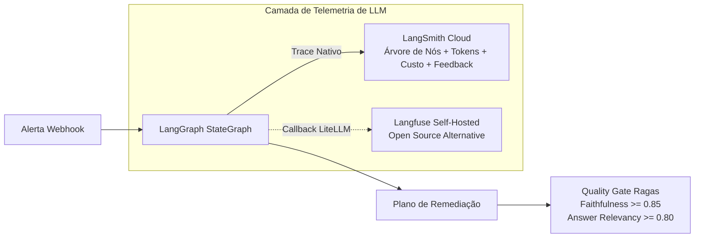

# Observabilidade de LLMs e Avaliação Contínua (LangSmith, Langfuse & Ragas)

No OpsMesh, sistemas multi-agentes que lidam com panes e incidentes críticos não podem ser uma "caixa preta". É mandatório rastrear cada decisão, calcular custos financeiros em tempo real e comprovar quantitativamente que os planos de remediação não contêm alucinações.

---

## 1. Tracing de Execução: LangSmith vs Langfuse



### Papel de Cada Plataforma no OpsMesh:

| Recurso | **LangSmith** | **Langfuse** |
| :--- | :--- | :--- |
| **Integração Principal** | **Nativa do LangGraph** (`LANGSMITH_TRACING=true`) | Callback via OpenTelemetry ou LiteLLM |
| **Visão da Topologia** | Árvore completa nó a nó (Supervisor -> Analistas -> Remediação) | Traces hierárquicos e gerações |
| **Monitoramento de Custos** | Cálculo automático de \$ por modelo e tokens consumidos | Métricas agregadas por usuário, sessão e chamada |
| **Feedback Humano (HITL)** | Feedback registrado diretamente no run_id (`user_score: 1.0/0.0`) | Anotações e tags de feedback |
| **Modelo Operacional** | Cloud SaaS gerenciado (Free tier ideal para o piloto) | Open Source / Self-Hostable |

---

## 2. Configuração do LangSmith no OpsMesh

A ativação é feita através de variáveis de ambiente de forma não-bloqueante (se o LangSmith estiver indisponível, o fluxo de investigação continua sem interrupção):

```bash
# .env
LANGSMITH_TRACING=true
LANGSMITH_ENDPOINT=https://api.smith.langchain.com
LANGSMITH_API_KEY=lsv2_pt_...
LANGSMITH_PROJECT=opsmesh
```

---

## 3. Avaliação Contínua de Assertividade (Ragas no CI/CD)

O OpsMesh valida a qualidade e assertividade do diagnóstico e da remediação através do framework **Ragas** executado contra os 4 cenários canônicos do Chaos Studio.

### Métricas Obrigatórias do Quality Gate:
1. **Faithfulness ($\ge 0.85$):**
   * Avalia se as evidências de diagnóstico e os comandos propostos são fundamentados exclusivamente nos logs recuperados e nos runbooks.
   * **Objetivo:** Zero alucinações em scripts de mitigação.
2. **Answer Relevancy ($\ge 0.80$):**
   * Mede se a ação proposta responde cirurgicamente à causa raiz do alerta, sem passos supérfluos ou desnecessários.
3. **Context Precision & Recall:**
   * Mensura se o `RunbookKnowledgeAgent` resgatou o manual operacional correto entre todos os runbooks disponíveis.

---

## 4. Documentação de APIs: Scalar (Padrão Obrigatório)

Em conformidade com a diretriz global de engenharia do projeto:
* O OpsMesh **abole o uso do Swagger UI legado**.
* Toda a exploração viva dos endpoints da API REST é disponibilizada via **Scalar** (`scalar-fastapi`) em `/docs` e `/scalar`.
