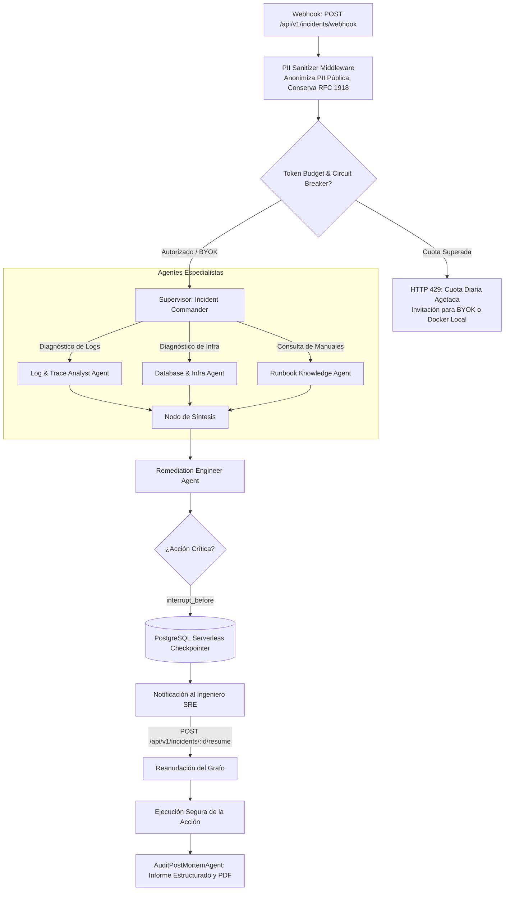

# Arquitectura del Sistema OpsMesh

La arquitectura de OpsMesh está diseñada para ser determinista, auditable, resiliente y protegida contra el abuso de tokens (FinOps), utilizando una topología jerárquica basada en LangGraph y StateGraph.

---

## Diagrama de la Topología Completa

---

## Componentes Clave

### 1. PII Sanitizer Middleware con Conservación de RFC 1918
- Anonimiza identificadores de clientes, tarjetas de crédito (Luhn), claves de API, JWTs, contraseñas e IPs públicas WAN.
- **Conserva rangos privados RFC 1918 (`10.x`, `172.16-31.x`, `192.168.x`)** y nombres de host de pods de Kubernetes para permitir el diagnóstico de red interna.

### 2. Checkpointer en PostgreSQL Serverless
- Utiliza `AsyncPostgresSaver` con Neon/Supabase para almacenar el estado de la investigación, permitiendo scale-to-zero con preservación íntegra de la memoria.

### 3. Blindaje FinOps y BYOK
- 5 capas de protección que impiden ataques de Denial of Wallet (DoW) en despliegues públicos de código abierto.
