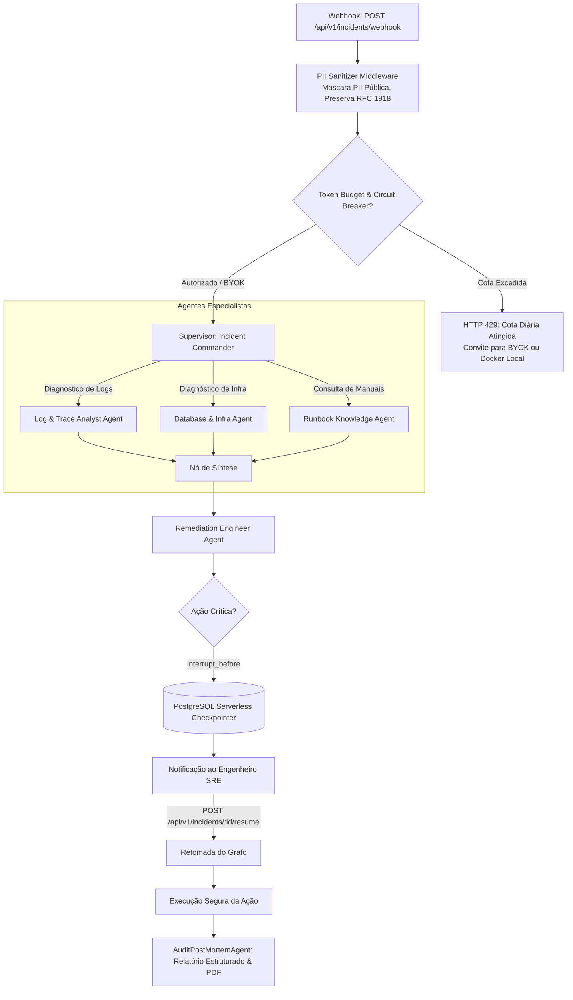

# Arquitetura do Sistema OpsMesh

A arquitetura do OpsMesh é projetada para ser determinística, auditável, resiliente e protegida contra abuso de tokens (FinOps), utilizando uma topologia hierárquica baseada em LangGraph e StateGraph.

---

## Diagrama da Topologia Completa

---

## Componentes Chave

### 1. PII Sanitizer Middleware com Preservação de RFC 1918
Antes de qualquer informação ser injetada no grafo ou enviada a provedores de LLM, o middleware de sanitização analisa expressões regulares para:
- CPFs, CNPJs e Documentos de Identidade
- Cartões de Crédito (PAN validado com algoritmo Luhn)
- Bearer Tokens, JWTs e Chaves de API
- Senhas e Credenciais em Connection Strings
- **Endereços IPv4/IPv6 Públicos (WAN):** Mascarados como `[REDACTED_PUBLIC_IP]`.
- **IPs de Redes Privadas RFC 1918 (`10.x`, `172.16-31.x`, `192.168.x`) e DNS interno de Pods K8s:** Estritamente preservados para que os agentes possam identificar qual pod ou nó do cluster está em pane.

### 2. Checkpointing Persistente
Utilizamos o `AsyncPostgresSaver` conectado a um PostgreSQL Serverless (Neon ou Supabase). Cada transição de estado entre nós é persistida. Se a instância sofrer desligamento (Scale-to-Zero), o estado pode ser restaurado imediatamente em qualquer outra réplica.

### 3. Blindagem FinOps & BYOK
O sistema protege o mantenedor contra esgotamento de tokens via rate limiting por IP, disjuntor diário de custos ($1.00/dia), modo de demonstração Replay com custo zero e suporte a cabeçalhos BYOK (`X-OpenAI-API-Key`, `X-DeepSeek-API-Key`).
