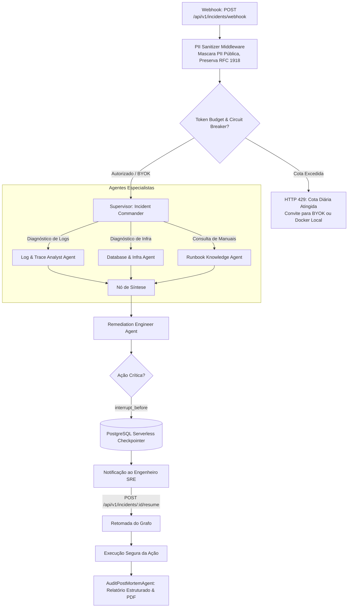

# Arquitetura do Sistema OpsMesh

A arquitetura do OpsMesh é projetada para ser determinística, auditável, resiliente e protegida contra abuso de tokens (FinOps), utilizando uma topologia hierárquica baseada em LangGraph e StateGraph.

---

## Diagrama da Topologia Completa

```mermaid
graph TD
    Alert["Webhook: POST /api/v1/incidents/webhook"] --> PII["PII Sanitizer Middleware<br/>Mascara PII Pública, Preserva RFC 1918"]
    PII --> GuardrailCheck{"Token Budget & Circuit Breaker?"}
    
    GuardrailCheck -->|Cota Excedida| Http429["HTTP 429: Cota Diária Atingida<br/>Convite para BYOK ou Docker Local"]
    GuardrailCheck -->|Autorizado / BYOK| Supervisor["Supervisor: Incident Commander"]
    
    subgraph Specialists [Agentes Especialistas]
        Supervisor -->|Diagnóstico de Logs| LogAgent["Log & Trace Analyst Agent"]
        Supervisor -->|Diagnóstico de Infra| InfraAgent["Database & Infra Agent"]
        Supervisor -->|Consulta de Manuais| RAGAgent["Runbook Knowledge Agent"]
        
        LogAgent --> Synthesis["Nó de Síntese"]
        InfraAgent --> Synthesis
        RAGAgent --> Synthesis
    end
    
    Synthesis --> Remediation["Remediation Engineer Agent"]
    Remediation --> HITL{"Ação Crítica?"}
    
    HITL -->|interrupt_before| Checkpoint[("PostgreSQL Serverless Checkpointer")]
    Checkpoint --> SRE["Notificação ao Engenheiro SRE"]
    SRE -->|"POST /api/v1/incidents/:id/resume"| Resume["Retomada do Grafo"]
    Resume --> Exec["Execução Segura da Ação"]
    Exec --> PostMortem["AuditPostMortemAgent: Relatório Estruturado & PDF"]
```

---

## Componentes Chave

### 1. PII Sanitizer Middleware com Preservação de RFC 1918
Antes de qualquer informação ser injetada no grafo ou enviada a provedores de LLM, o middleware de sanitização analisa expressões regulares para:
- CPFs, CNPJs e Documentos de Identidade
- Cartões de Crédito (PAN validado com algoritmo Luhn)
- Bearer Tokens, JWTs e Chaves de API
- Senhas e Credenciais em Connection Strings
- **Endereços IPv4/IPv6 Públicos (WAN):** Mascarados como `[REDACTED_PUBLIC_IP]`.
- **IPs de Redes Privadas RFC 1918 (`10.x`, `172.16-31.x`, `192.168.x`) e DNS interno de Pods K8s:** Estritamente preservados para que os agentes possam identificar qual pod ou nó do cluster está em pane.

### 2. Checkpointing Persistente
Utilizamos o `AsyncPostgresSaver` conectado a um PostgreSQL Serverless (Neon ou Supabase). Cada transição de estado entre nós é persistida. Se a instância sofrer desligamento (Scale-to-Zero), o estado pode ser restaurado imediatamente em qualquer outra réplica.

### 3. Blindagem FinOps & BYOK
O sistema protege o mantenedor contra esgotamento de tokens via rate limiting por IP, disjuntor diário de custos ($1.00/dia), modo de demonstração Replay com custo zero e suporte a cabeçalhos BYOK (`X-OpenAI-API-Key`, `X-DeepSeek-API-Key`).

### 4. Ecossistema Chaos Lab & Inspeção Cirúrgica via GitHub API
O OpsMesh opera de forma totalmente desacoplada contra a aplicação alvo **Chaos Lab** (`d:\ChaosLab`). Quando um alerta do Datadog indica uma exception (ex: `services/checkout.py:142`):
- O agente não clona o repositório em disco; ele faz uma requisição remota stateless à **GitHub REST API** (`GET /repos/{owner}/{repo}/contents/{path}?ref=main`).
- Recupera a janela de contexto exata do código ativo em produção.
- Correlaciona o erro do APM com a linha de código real e o runbook operacional correspondente.

### 5. Padrão Ouro de Remediação em Dois Níveis (Two-Tier Remediation)
A remediação formulada pelo `RemediationEngineerAgent` e aprovada pelo engenheiro no portão HITL executa em dois tempos:
1. **Nível 1 (Runtime Mitigation):** Chamada de API operacional protegida no Chaos Lab (`POST /operations/mitigate`) em menos de 5 segundos para estancar a crise e zerar a taxa de erro no Datadog.
2. **Nível 2 (GitOps Pull Request):** Abertura automática de um Pull Request no GitHub do Chaos Lab com o patch definitivo, justificativa técnica e links para revisão e merge da equipe.

### 6. Decision Models Especializados (Jev First) & OpenRouter Gateway
Para tarefas que exigem estritamente classificação, roteamento e determinação de parada sem geração de texto longo para o usuário:
- **Jev (`typesafe/jev-latest` via OpenRouter):** Modelo "System One" ultrarrápido com latência sub-30ms e custo de output \$0.00.
- **Primitivas Nativas:** `Choice` (seleção categórica de especialista para o próximo passo) e `Noul` (decisão booleana de convergência da causa raiz `is_investigation_complete` com probabilidade calibrada de 0.0 a 1.0).
- **OpenRouter Provider & Frota `:free` (Coleção Oficial):** Suporte nativo ao OpenRouter, com acesso à frota oficial de modelos gratuitos (`https://openrouter.ai/collections/free-models`) desbloqueada por saldo mantido > \$10 (`openrouter/free`, `nvidia/nemotron-3-ultra-550b-a55b:free`, `poolside/laguna-s-2.1:free`, `cohere/north-mini-code:free`).

### 7. Observabilidade Unificada & Tracing Distribuído Datadog Pro APM (`ddtrace`)
- **Tracing de Nós LangGraph:** O OpsMesh é instrumentado com `dd-trace-py`, registrando spans hierárquicos para o Supervisor, Analistas e Remediação.
- **Propagação de Contexto Distribuído:** Propagação de cabeçalhos W3C (`traceparent`) e Datadog (`x-datadog-trace-id`), garantindo visão unificada: injeção no Chaos Lab ➔ APM Datadog ➔ alerta webhook ➔ investigação OpsMesh ➔ mitigação em runtime.

### 8. Armazenamento Vetorial Serverless & OLAP Zero-Daemon (LanceDB + DuckDB / Parquet)
- **LanceDB Serverless:** Motor vetorial disk-based sem containers pesados em background, provendo busca híbrida (vetorial densa + busca textual Tantivy) para os manuais de crise (runbooks SOPs).
- **DuckDB + Parquet para Auditoria e Analytics:** Persistência analítica em arquivos colunares `.parquet` de todos os incidentes resolvidos, permitindo consultas SQL ultrarrápidas com DuckDB para métricas de MTTR histórico, custos evitados e frequência de falhas por serviço.

### 9. Red-Teaming Gate Automatizado (Promptfoo no CI/CD)
- **Pentest Automatizado de Agentes:** Configuração de suíte de testes adversários via `promptfooconfig.yaml` executada no GitHub Actions CI.
- **Guardrails Invioláveis Auditados:** Verificação determinística contra injeções de prompt no payload de logs/alertas, tentativas maliciosas de contornar o portão HITL e vazamento acidental de chaves ou PII nos relatórios pós-incidente.

