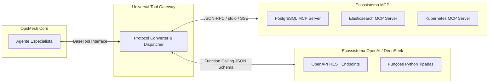

# Universal Tool Gateway (MCP + OpenAI Tools)

O **Universal Tool Gateway** do OpsMesh soluciona a fragmentação de padrões de ferramentas na indústria de inteligência artificial.

---

## O Problema dos Protocolos Isolados

Historicamente, ferramentas de IA são implementadas de duas formas conflitantes:
1. **Model Context Protocol (MCP) da Anthropic:** Baseado em JSON-RPC 2.0 sobre `stdio` ou `SSE`, ideal para conectar processos locais, CLIs e serviços corporativos.
2. **OpenAI Function Calling:** Padrão adotado pela OpenAI, DeepSeek (V3 e R1), Groq, Mistral, Ollama e vLLM baseado em schemas JSON dentro do payload do chat completion.

---

## Arquitetura do Gateway Adaptador

---

## Vantagens para o OpsMesh

* **Compatibilidade com DeepSeek:** Podemos utilizar o modelo `deepseek-chat` ou `deepseek-reasoner` sem abrir mão de ferramentas que foram desenvolvidas para servidores MCP.
* **Sem Vendor Lock-in:** O time de engenharia pode alternar o provedor de LLM entre OpenAI, Anthropic, DeepSeek ou Llama local sem refazer uma única linha do código das ferramentas.
