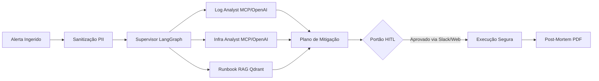

# 🚨 OpsMesh — Autonomous Incident Commander

> **Sistema Multi-Agente Autônomo de Resposta a Incidentes Críticos e SRE**  
> Construído sobre **LangGraph**, **Model Context Protocol (MCP)**, **OpenAI Tools (DeepSeek / GPT / Llama)**, **PostgreSQL Serverless** e **Human-in-the-Loop (HITL)**.

> 🌐 **Ambiente Oficial Online (Google Cloud Run):**  
> 🔗 **Console SRE & Chaos Studio:** [https://opsmesh-197215016090.us-central1.run.app](https://opsmesh-197215016090.us-central1.run.app)  
> 📖 **Documentação Interativa de APIs (Scalar):** [https://opsmesh-197215016090.us-central1.run.app/docs](https://opsmesh-197215016090.us-central1.run.app/docs)  
> 🩺 **Health Check & Telemetria:** [https://opsmesh-197215016090.us-central1.run.app/health](https://opsmesh-197215016090.us-central1.run.app/health)

---

## 🌟 O que é o OpsMesh?

O **OpsMesh** atua como um Comandante de Incidentes (*Incident Commander*) de nível Staff SRE para sistemas distribuídos em nuvem. Quando alertas disparam no Datadog, Prometheus ou Grafana, o OpsMesh:

1. **Ingere e Sanitiza:** Recebe o alerta e remove qualquer informação pessoal sensível (**LGPD / GDPR**) antes da análise por IA.
2. **Investiga em Paralelo:** Aciona agentes especializados em logs (analisando padrões no LogHub e Elastic) e infraestrutura (Postgres, Redis, Kubernetes).
3. **Consulta a Base de Conhecimento:** Realiza **RAG Híbrido** sobre os manuais de crise (*runbooks*) da organização.
4. **Formula o Plano de Mitigação:** Cria o diagnóstico de causa raiz e gera o *diff* de código/configuração necessário para estancar a crise.
5. **Garante Aprovação Humana (HITL):** Ações destrutivas ou de mitigação pausam no checkpoint do PostgreSQL Serverless até autorização expressa do engenheiro de plantão.
6. **Executa e Gera Post-Mortem:** Aplica a remediação e compila o relatório pós-incidente completo em PDF.

---

## 🚀 Diferenciais de Engenharia

```mermaid
graph LR
    A[Alerta Ingerido] --> B[Sanitização PII]
    B --> C[Supervisor LangGraph]
    C --> D[Log Analyst MCP/OpenAI]
    C --> E[Infra Analyst MCP/OpenAI]
    C --> F[Runbook RAG Qdrant]
    D & E & F --> G[Plano de Mitigação]
    G --> H{Portão HITL}
    H -->|Aprovado via Slack/Web| I[Execução Segura]
    I --> J[Post-Mortem PDF]
```

* **FinOps Serverless ($0/mês):** Desenvolvido para **Scale-to-Zero** no Google Cloud Run e Azure Container Apps. Em repouso, sem alertas, o custo de computação é rigorosamente nulo.
* **Decision Models Especializados (Jev First):** Roteamento e convergência do Supervisor via **Jev (`typesafe/jev-latest` via OpenRouter)** com latência sub-30ms e custo de output $0.00.
* **Universal Tool Gateway:** Interoperabilidade nativa entre ferramentas no formato **Anthropic MCP** e **OpenAI Function Calling (DeepSeek / GPT)**.
* **OpenRouter Gateway & Frota Free:** Acesso à frota oficial de modelos gratuitos (`openrouter/free`, `nvidia/nemotron-3-ultra-550b-a55b:free`, `poolside/laguna-s-2.1:free`, `cohere/north-mini-code:free`) com cotas ampliadas por saldo mantido > $10 e suporte BYOK (`X-OpenRouter-API-Key`).
* **Datadog Pro APM & Tracing Distribuído:** Instrumentação nativa (`ddtrace`) com propagação de contexto (`traceparent`), correlacionando anomalias do Chaos Lab e spans do LangGraph.
* **Armazenamento Zero-Daemon:** Suporte a **LanceDB** (vetores serverless em disco, $0 de infra) e **DuckDB + Parquet** para auditoria e queries analíticas de MTTR.
* **Red-Teaming Gate (Promptfoo):** Pentest automatizado no CI/CD contra jailbreaks, bypass do portão HITL e extração de PII.
* **Documentação Viva com Scalar:** Interface interativa de última geração para testar os endpoints da API REST em tempo real.
* **Ecossistema Chaos Lab:** Aplicação companheira independente (`d:\ChaosLab`) com injeção de falhas em tempo real e instrumentação nativa com Datadog APM.
* **Inspeção Cirúrgica via GitHub API:** Leitura remota e stateless do arquivo e linha exatos na branch `main` apontados pelo stack trace do Datadog.
* **Remediação em Dois Níveis:** Mitigação imediata em runtime (< 5s) para zerar a taxa de erro + Abertura automática de Pull Request documentado no GitHub para correção definitiva da causa raiz.

