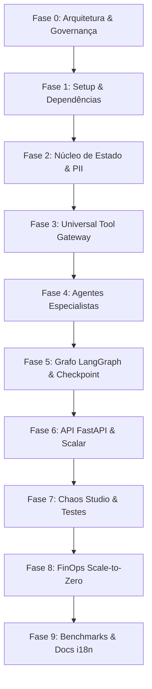

# Roadmap e Backlog de Tarefas

> Esta página apresenta a visão consolidada do backlog de engenharia. Para o checklist dinâmico de execução, consulte também o arquivo [TASK.md](file:///d:/OpsMesh/TASK.md).

---

## Fases do Projeto

---

## Status Resumido

- **Fase 0 (Arquitetura e Contratos):** Concluída com sucesso (PRD, Especificação Técnica, AGENTS, Pre-commit, MkDocs e Scalar definidos).
- **Fase 1 a 9:** Prontas para execução progressiva via *Vibe Coding*.
